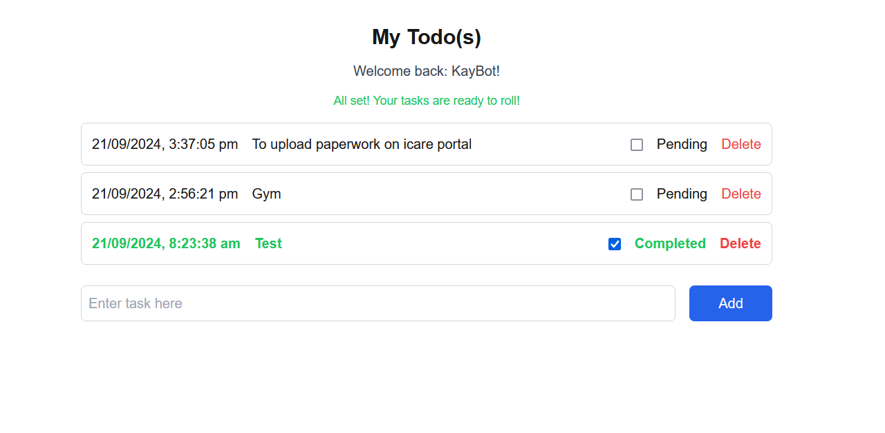

This is a [Next.js](https://nextjs.org) project bootstrapped with [`create-next-app`](https://nextjs.org/docs/app/api-reference/cli/create-next-app).

## User Interface

This [repository](https://github.com/KaybotV2/todo-ui.git) contains the frontend for the Todo app, built using React, Next.js, TypeScript, and Tailwind CSS.

```bash
#To clone the repository, use the following command:

git clone https://github.com/KaybotV2/todo-ui.git

# Once cloned, navigate to the project folder:

cd todo-ui

# Install the required dependencies using npm:

npm install

# To run the application in development mode:

npm run dev
```

A serverless To-Do app built with AWS CDK, leveraging Python for backend, and a modern frontend stack of React, Next.js, and TypeScript for a seamless and scalable task management experience.


## API 
The [/api](https://github.com/KaybotV2/My-Todo-App/tree/main/api) contains the Python FastAPI code.

The [/test](https://github.com/KaybotV2/My-Todo-App/tree/main/test) contains the Pytest integration tests to test your endpoint directly. 

You can run the test like this.

```bash
pytest
```
# API Documentation 
Welcome to the [FastAPI AWS Documentation](https://lnp5n7ywijpzmt7qegq3xfh7w40utqiq.lambda-url.us-east-1.on.aws/docs#/)! This guide offers a comprehensive overview of the API endpoints available for each CRUD operation, helping you effectively interact with your FastAPI application.


## AWS Resources
The [/todo-aws-resources](https://github.com/KaybotV2/todo-aws-resources) repository  contains the CDK code to deploy all the infrastructure (Lambda function and DynamoDB table) to your AWS account.

## Prerequisites

You must have the following installed and configured on your machine:

- [AWS CLI](https://aws.amazon.com/cli/) 
- [AWS CDK](https://docs.aws.amazon.com/cdk/v2/guide/home.html)


First, install the node modules.

```bash
npm install
```

Then run bootstrap if you never used CDK with your account before.

```bash
cdk bootstrap
```

Deploy the stack. 

```bash
cdk deploy
```


## Developer Getting Started

First, run the development server:

```bash
npm run dev
# or
yarn dev
# or
pnpm dev
# or
bun dev
```

Open [http://localhost:3000](http://localhost:3000) with your browser to see the result.

You can start editing the page by modifying `app/page.tsx`. The page auto-updates as you edit the file.

This project uses [`next/font`](https://nextjs.org/docs/app/building-your-application/optimizing/fonts) to automatically optimize and load [Geist](https://vercel.com/font), a new font family for Vercel.

## Learn More

To learn more about Next.js, take a look at the following resources:

- [Next.js Documentation](https://nextjs.org/docs) - learn about Next.js features and API.
- [Learn Next.js](https://nextjs.org/learn) - an interactive Next.js tutorial.

You can check out [the Next.js GitHub repository](https://github.com/vercel/next.js) - your feedback and contributions are welcome!

## Deploy on Vercel

The easiest way to deploy your Next.js app is to use the [Vercel Platform](https://vercel.com/new?utm_medium=default-template&filter=next.js&utm_source=create-next-app&utm_campaign=create-next-app-readme) from the creators of Next.js.

Check out our [Next.js deployment documentation](https://nextjs.org/docs/app/building-your-application/deploying) for more details.
